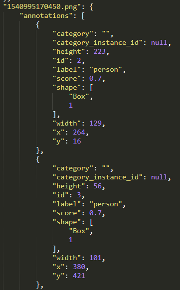
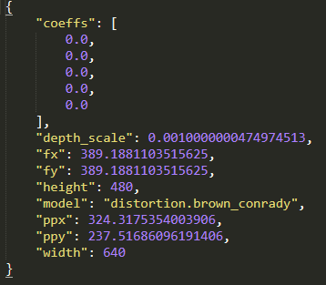
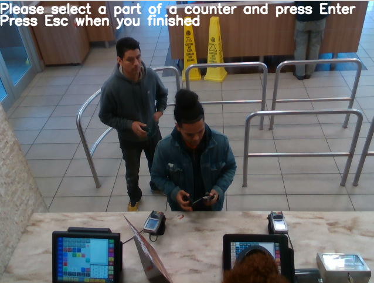
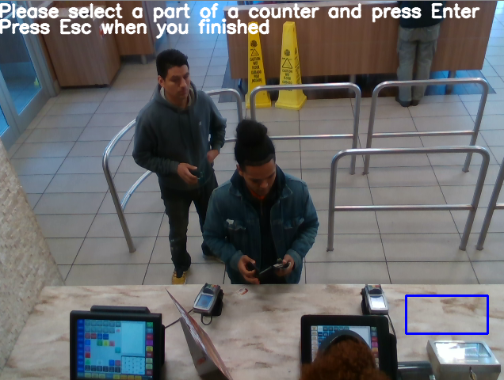
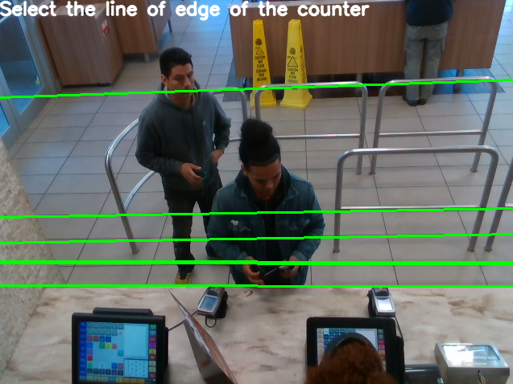
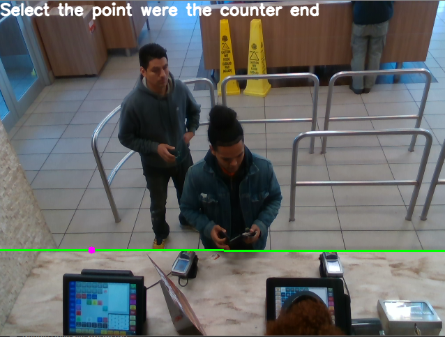

# 3DActionsDetection

## Required

1. You need to have istalled Openpose then you have to create a folder `asset_openpose/` witch contains `/bin`,`python`,`models` and if you are on windows `x64` from Openpose. 

2. You need to have in the folder `json_in` 2 files : 
- One annotation file which look like :

- One json which contains the intrinsic parameters of the camera used :

3. You need to import your RGB and Depth images in the folders `images\RGB` and `images\Depth`. It is important that the images in RGB and in Depth file have the same names. 

## How to run the program

First of all **delete** all the files called `ToDelete.txt` in the empty folders.

Run the program called `Main.py`. You are going to get the first image of the your fastfood images. 

Now you must select the desk with a simple Rois Selection. Draw your Rois selection and press **enter** to validate. Draw as much Rois as you want. 

The more there is Rois the more the program is efficient. When you are done press **esc**. You'll get different lines :

Select the correct line of the end of the desk. You'll have to select 2 points of the line that are really on the desk. 

Then the program is running. It can take a lot of time that depends on you computer configuration and the number of images imported. 

